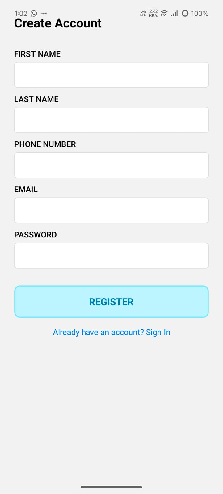
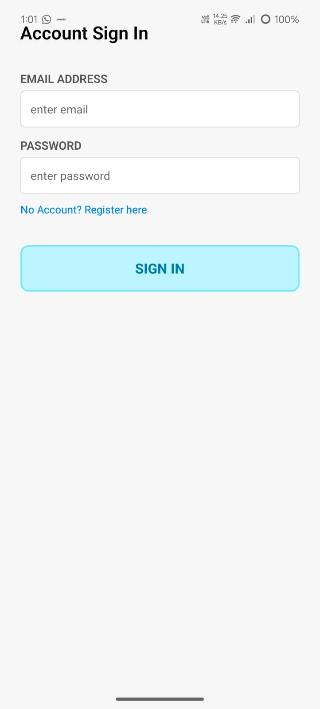
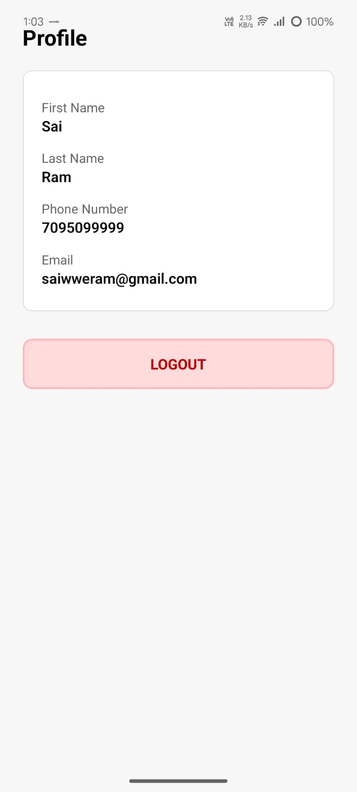

# Account-Setup (React Native + TypeScript)

## Summary
Local-only React Native app that replicates the "Account setup" flow (no CAPTCHA), stores credentials securely with Expo SecureStore, persists registration drafts, validates inputs, and provides Login and Home/Profile screens.

## Quick start (development)
1. Clone the repo:
   ```bash
   git clone https://github.com/<your-username>/account-setup.git
   cd account-setup
Install:

2.npm install


3.Start Expo:

npm run start


4.Run on Android emulator/device:

.npm run android


5.Run on iOS simulator/device:

npm run ios

Validation rules implemented

Email: /^[^\s@]+@[^\s@]+\.[^\s@]+$/

Password: min 6 chars (can be extended for strength)

Confirm password: must match password

Phone: digits only (7–15 digits in some places, or exact 10 digits if required)

First/Last name: required, trimmed non-empty

Inline errors and disabled submit until the form is valid (react-hook-form + yup / custom validators).

Security approach

Credentials stored with Expo SecureStore (Keychain/Keystore).

Non-sensitive draft data persisted to AsyncStorage.

No plaintext secrets committed to the repo.

No network calls are made to the referenced website — local-only.

Logout clears SecureStore.

Tests

Unit tests for validation functions and auth storage mocking with Jest.

Run tests with:

npm test

## 📸 Screenshots
| Register Page |  |
| Login Page |  |
| Home Screen |  |